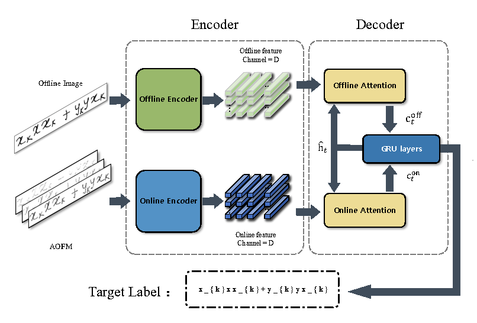

# VIEWING WRITING AS VIDEO: OPTICAL FLOW BASED MULTI-MODAL HANDWRITTEN MATHEMATICAL EXPRESSION RECOGNITION [ICASSP 2024]
Offical implementation of Optical Flow Aware Network

<p align='center'>
  <b>
    <a href="https://ieeexplore.ieee.org/document/10447346">Paper</a>
    | 
    <a href="https://github.com/Hanbo-Cheng/OFAN/">Code</a> 
  </b>
</p> 
  <p align='center'>  
    
  </p>

In this work, we perceive the writing process as a video and introduce the Aggregated Optical Flow Map (AOFM) to represent the online modality, which is more compatible with the offline modality. Additionally, we propose the Op-
tical **Flow Aware Network (OFAN)** in order to automatically extract, align, and fuse the features across online and offline modalities. Through experiment analysis, our method can be seamlessly applied to multiple existing offline HMER models, thereby yielding stable and substantial enhancements across CROHME 2014, 2016, and 2019 datasets

unzip the `CROHME.zip`


```
unzip CROHME.zip
```


## train
training WAP-OFAN:
```
python train_optical.py
```


training WAP only with AOFM (online modality):
```
python train_optical_single.py
```

training original WAP (offline modality):
```
python train_wap.py
```

## test

testing WAP-OFAN:
```
bash test_on.sh
```

testing test_on_single.sh:
```
bash test_on_single.sh
```

testing original WAP:
```
bash test.sh
```


